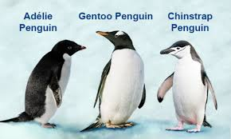

## ETL Palmer Penguins (R)

### What is an ETL? ?

* Extract: Fetch the data.

* Transform: Clean, prepare, and transform.

* Load: Load or prepare the data for analysis or modeling.

In this exercise, we will work with the “Palmer Penguins” dataset. This dataset contains data on three species of penguins from the Palmer Archipelago (Antarctica), with variables such as:

* species

* island

* bill length and depth

* flipper length

* body mass

* sex

* year



```{r setup, include=FALSE}
# Evitamos mostrar los mensajes y advertencias en todos los chunks del documento
knitr::opts_chunk$set(
  echo = TRUE,       # Mostrar el código
  warning = FALSE,   # Ocultar advertencias
  message = FALSE    # Ocultar mensajes (por ejemplo, mensajes al cargar paquetes)
)
```


```{r include=FALSE}
# Pretty Doc permite crear documentos R Markdown con temas visualmente más atractivos y modernos
#install.packages("prettydoc")
```

Let's see the location of Palmer Station:

```{r}
#install.packages("leaflet")
library(leaflet)

# Location of Palmer Station
# -64.77416897295598, -64.05381917264792

# Interactive map
leaflet() %>%
  addTiles() %>%
  addMarkers(lat = -64.77416897295598, lng = -64.05381917264792, popup = "Estacion Palmer")
```


```{r}
# library
library(tidyverse)
library(dplyr)
library(ggplot2)
library(plotly)

```

## 1. EXTRACT

We load the study dataset:

```{r}
# install the package
#install.packages("palmerpenguins")

# view the dataset (first 6 rows)
head(penguins)

```

We note that we have 344 observations and 8 variables. The categorical variables are already factors (species, island, and sex), so we don’t need to convert them.

Dataset structure:

```{r}
str(penguins)
```

We can also generate a detailed summary


```{r}
summary(penguins)
```

```{r}

library(skimr)

skim(penguins)
```


## 2. TRANSFORM

This is the most important step. A good ETL ensures data consistency and readiness for analysis.

There are missing values. We must decide whether to drop them or impute them, for example using the median. Since there are few, we’ll remove them:

```{r}
# Remove NAs
library(tidyr)

penguins_df <- drop_na(penguins)

str(penguins_df)
```

```{r}
# Update column names (spanish):
nuevos_nombres <- c("especie", "isla","longitud_pico", "ancho_pico", "longitud_aleta","peso_corporal", "genero", "año")

colnames(penguins_df) <- nuevos_nombres

# Check new column names:
colnames(penguins_df)

```

We can group the data and calculate statistics:

```{r}
penguins_df %>% group_by(especie) %>% summarise(promedio_long_pico = mean(longitud_pico), promedio_ancho_pico = mean(ancho_pico))
```


Convert body mass from grams to kilograms:

```{r}

penguins_df$peso_corporal <- penguins_df$peso_corporal / 1000
head(penguins_df)

```

## 3. LOAD

We now have a clean dataset ready for analysis or modeling.

Save the transformed dataset to CSV:

```{r}
write.csv(penguins_df, "penguins_transformado.csv", row.names = FALSE)
```


## Visualizations

Boxplot with ggplot2:

```{r}
graf_box <- ggplot(penguins_df, aes(x = especie, y = peso_corporal, fill = especie)) + 
  geom_boxplot() + 
  labs(title = "Boxplot of Body Mass by Species", subtitle = "Palmer Island Penguins", caption = "Data collected between 2007 and 2009") + 
  theme_minimal()

graf_box

```

Trend line and scatter plot:

```{r}

linea_tendencia <- ggplot(penguins_df) +
  geom_smooth(aes(x = longitud_aleta, y = peso_corporal)) +
  geom_point(aes(x = longitud_aleta, y = peso_corporal)) +
  labs(title = "Trend Line: Flipper Length vs Body Mass") +
  theme_bw()


ggplotly(linea_tendencia)
```

Facet by species:

```{r}

ggplotly(ggplot(penguins_df) +
  geom_point(aes(x = longitud_pico, y = peso_corporal, color = especie)) +
  facet_wrap(~especie) +
  labs(title = "Bill Length vs Body Mass by Species") +
  theme_bw())
```

Facet grid by species and sex:

```{r}

ggplot(penguins_df)+
  geom_point(aes(x = longitud_aleta, y = peso_corporal, color = especie)) +
  facet_grid(genero~especie) +
  labs(title = "Body Mass vs Flipper Length by Species and Sex") +
  theme_bw()
```

Heatmap:

```{r}

heatmap <- ggplotly(ggplot(penguins_df, aes(x = isla, y = especie)) +
  labs(title = "Heatmap: Species vs Island") +
  geom_bin2d())

heatmap
```


```{r include=FALSE}
# ggplot2 permite guardar el ultimo grafico cargado en la carpeta donde se encuentra este notebook:

ggsave("pinguinos_facet_grid.png")

# Tambien se puede guardar como pdf, debemos escribir estas tres lineas de codigo
# pdf() abre un nuevo dispositivo gráfico vacío (una hoja nueva)
# el grafico que queremos guardar como pdf
# dev.off() cierra el archivo y guarda lo que se haya dibujado
pdf(file = "pinguinos.pdf")
heatmap
dev.off()
```

